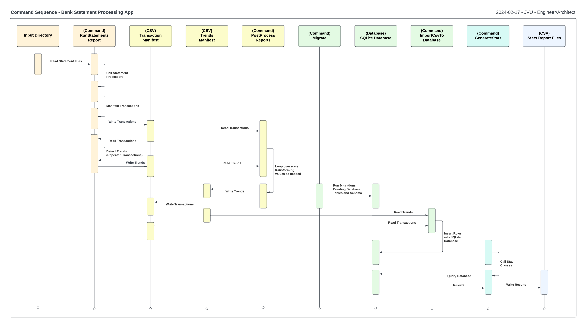

# Summary
(Work in progress - Documentation Pending)

## Goals
Input statements from several different banks and the software outputs several reports: 

1. **Transaction Report** - *(Achieved)* Inline aggregate of all transactions from each statement in a single data file 
2. **Trend Report** - *(Achieved)* Inline aggregate of all repeated transactions with a categories defining the spend 
3. **Transaction Summary Report** - Print out of statistical trends identified across all inputs (In Progress)

---
# Roadmap 

## Q1-2024 
1. **Transaction Summary Report** - *(Feature)*

    - **TASK** - Leverage SQLite to query Transaction and Trend Reports to generate statistics
    - **TASK** - Visualize statistics using modular widgets
    - **TASK** - Provide web and print versions of the Transaction Summary Report
    - **TASK** - Add statement processing for PNC and Bank of America 

--- 
## Process Diagram

---
## Changelog

2024-02-17 - Added 'CacheStats' feature to print statistics to CSV after querying SQLite database